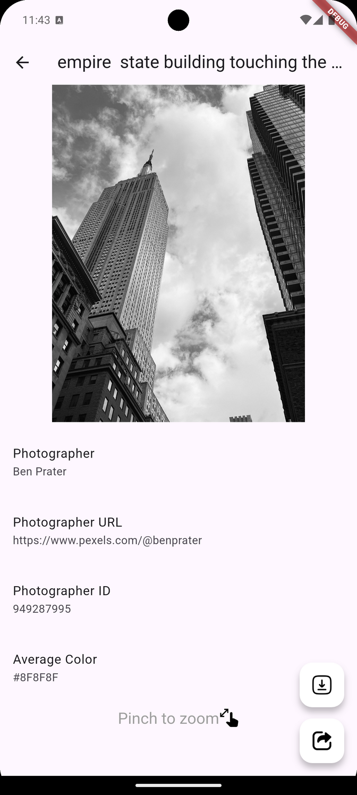

Here’s a well-structured **README.md** file for your **Potential Gallery** app:

---

# **Potential Gallery**

**Potential Gallery** is a Flutter-based gallery application that leverages the **Pexels Curated API** to display stunning curated photos. The app includes features like pagination, data caching, and the ability to download and share photos, providing a seamless and engaging user experience even in offline mode.

---

## **Features**

- **Explore Curated Photos**: Browse through beautiful photos from the Pexels Curated API.
- **Pagination**: Load more photos as you scroll for a smooth browsing experience.
- **Offline Mode**: Data is cached locally using the **Hive** package, allowing users to explore previously viewed photos without an internet connection.
- **Download Photos**: Download photos directly to your device using the **Dio** package.
- **Share Photos**: Share your favorite photos with others using the **Share Plus** package.
- **User-Friendly UI**: A clean and responsive interface designed for an optimal user experience.

---

## **Screenshots**





---

## **Installation**

Follow these steps to set up the project locally:

### **Prerequisites**

- Flutter SDK installed on your machine.
- A valid Pexels API key. [Sign up for a free API key](https://www.pexels.com/api/).

### **Steps**

1. Clone the repository:
   ```bash
   git clone https://github.com/your-repo/potential-gallery.git
   ```
2. Navigate to the project directory:
   ```bash
   cd potential-gallery
   ```
3. Install dependencies:
   ```bash
   flutter pub get
   ```
4. Add your **Pexels API key**:
   - Create a `.env` file in the root directory.
   - Add the following line:
     ```env
     PEXEL_API_KEY=your_pexels_api_key
     ```
5. Run the app:
   ```bash
   flutter run
   ```

---

## **Packages Used**

- **[flutter_dotenv](https://pub.dev/packages/flutter_dotenv)**: Manage environment variables securely.
- **[get](https://pub.dev/packages/get)**: Simplify state management and routing.
- **[dio](https://pub.dev/packages/dio)**: For handling HTTP requests and downloads.
- **[hive](https://pub.dev/packages/hive)**: Lightweight and fast database for local caching.
- **[cached_network_image](https://pub.dev/packages/cached_network_image)**: Efficient image loading and caching.
- **[share_plus](https://pub.dev/packages/share_plus)**: For sharing content across different platforms.
- **[flutter_staggered_grid_view](https://pub.dev/packages/flutter_staggered_grid_view)**: For a beautiful, staggered photo gallery layout.
- **[shimmer](https://pub.dev/packages/shimmer)**: Add shimmer effects to indicate loading states.

---

## **APIs Used**

- **Pexels Curated API**: Fetch curated photo collections for the gallery.
  - API Documentation: [Pexels API Docs](https://www.pexels.com/api/)

---

## **App Highlights**

1. **Efficient Pagination**:

   - Load more images seamlessly as the user scrolls.

2. **Offline Mode with Hive**:

   - Photos are cached locally to ensure accessibility without an internet connection.

3. **Photo Download**:

   - Download photos to the device storage using the Dio package.
   - Permissions for storage are managed dynamically.

4. **Share Functionality**:

   - Share your favorite photos directly from the app using Share Plus.

5. **Clean UI**:
   - Features responsive design and smooth transitions for an enhanced user experience.

---

## **Contributing**

Contributions are welcome! Please follow these steps:

1. Fork the repository.
2. Create a new branch:
   ```bash
   git checkout -b feature-name
   ```
3. Commit your changes:
   ```bash
   git commit -m "Add feature-name"
   ```
4. Push to the branch:
   ```bash
   git push origin feature-name
   ```
5. Open a Pull Request.

---

## **License**

This project is licensed under the MIT License. See the [LICENSE](LICENSE) file for details.

---

## **Acknowledgments**

- Special thanks to **Pexels** for providing the curated photo collections.
- Gratitude to the developers and maintainers of the open-source packages used in this app.
